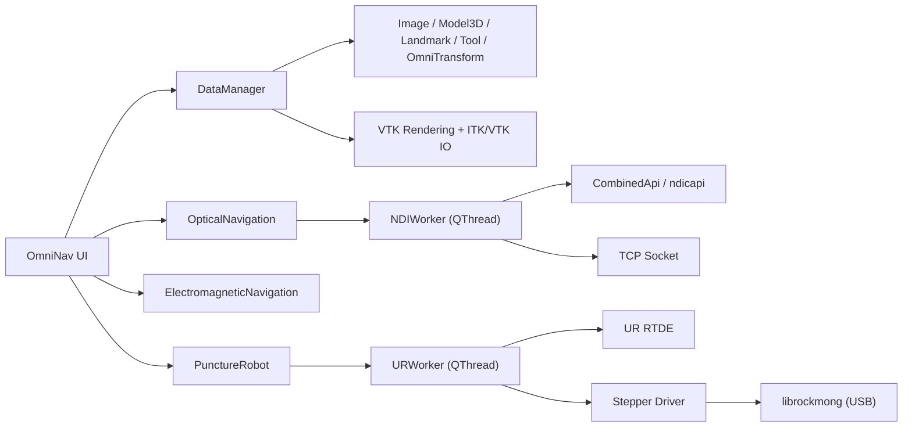

# OmniNav - Medical Imaging Navigation and Robotic Puncture System

[](https://isocpp.org/)
[](https://www.qt.io/)
[](https://vtk.org/)
[](https://itk.org/)
[](LICENSE)

> **OmniNav** is a modular, cross-platform medical imaging navigation application that integrates multi-view VTK visualization, optical tracking (NDI Combined API), and a robotic puncture workflow (Universal Robots + stepper-motor end effector). It supports DICOM/NIfTI import, 3D model rendering, tool registration and calibration, real-time tracking, and robot control.

---

## 📑 Table of Contents
- [Core Features](#core-features)
- [System Architecture](#system-architecture)
- [Tech Stack](#tech-stack)
- [Hardware Requirements](#hardware-requirements)
- [Dependency Installation](#dependency-installation)
- [Build Guide](#build-guide)
- [Configuration Files](#configuration-files)
- [Quick Start](#quick-start)
- [Project Structure](#project-structure)
- [Module Details](#module-details)
- [Data Format Support](#data-format-support)
- [Development Guide](#development-guide)
- [Troubleshooting](#troubleshooting)
- [Testing and Validation](#testing-and-validation)
- [Contributing](#contributing)
- [License](#license)

---

## 🎯 Core Features

### Imaging Visualization
- ✅ **Four synchronized views**: Axial, 3D, Coronal, Sagittal
- ✅ **Crosshair linkage**: cross-view navigation; clicking one view syncs the others
- ✅ **Slice scrolling**: mouse wheel or slider
- ✅ **Window/level adjustment**: real-time contrast tuning

### Data Import/Export
- 📁 **Medical images**: DICOM (folder or single `.dcm`), NIfTI (`.nii`/`.nii.gz`), NRRD, MHD/MHA
- 🧊 **3D models**: STL, OBJ, PLY, VTK, VTP, G (for mesh/surface)
- 📍 **Tool definitions**: NDI `.rom` files (tool geometry and markers)
- 📊 **Calibration data**: JSON landmarks/transforms import/export
- 📝 **Text**: `.txt` imported into the info panel

### Optical Navigation (NDI)
- 🔗 **Device connection**: TCP/IP to NDI optical tracking systems (Polaris, Spectra, Vega, etc.)
- 📍 **Tool tracking**: real-time 6D pose (position + orientation)
- 🎯 **Sampling mode**: multi-frame averaging for stable poses
- 🔄 **Registration**: align tool coordinates to image coordinates
- ⚙️ **Calibration**: tool tip-to-tip transform calibration

### Robotic Puncture Workflow
- 🤖 **UR robot control**: connect to Universal Robots via RTDE
- 🛠️ **Stepper motor drive**: needle feed control (USB device via `librockmong`)
- 🔧 **End-effector configuration**: flange-to-EEF transform matrix with custom tool support
- 📋 **Workflow wizard**: guided puncture planning and execution

### User Interface
- 🧩 **Modular design**: each module is independent and can be enabled/disabled via config
- 📊 **Table management**: landmarks, tools, transforms managed in tables
- 🎨 **Customizable look**: view colors, transparency, and camera parameters are configurable
- 💾 **Config persistence**: JSON configs are auto-copied next to the executable

---

## 🏗️ System Architecture



### Architecture Notes

- **Main window (Base)**: Qt shell that manages menus, toolbars, module loading, and view layout
- **Data layer (DataManager)**: unified management of images, models, landmarks, tools, and transforms
- **Rendering layer (VTK)**: high-performance OpenGL rendering with volume and surface rendering
- **Module system**: each module (OpticalNavigation, PunctureRobot, etc.) is built independently and communicates via interfaces
- **Thread model**: hardware I/O (NDI, UR, stepper) runs in dedicated QThreads to keep the UI responsive
- **Config system**: JSON config files define module parameters and are copied to the output directory at build time

---

## 🔧 Tech Stack

| Component | Version | Purpose |
|------|------|------|
| **C++** | C++20 | Core language, using concepts/coroutines (optional), modules (future) |
| **Qt** | 5.15+ | GUI framework (Widgets), networking, serial, threading |
| **VTK** | 9.0+ | 3D rendering, image processing, visualization |
| **ITK** | 5.0+ | Medical image IO (DICOM, NIfTI) and preprocessing |
| **NDI API** | Combined API | Optical tracking device communication |
| **UR RTDE** | 1.0+ | Universal Robots real-time data exchange |
| **spdlog** | 1.x | High-performance logging |
| **Eigen3** | 3.4+ | Linear algebra (matrices) |
| **Boost** | 1.70+ | System and thread libraries |
| **librockmong** | - | Stepper motor USB driver (Windows x64) |
| **CMake** | 3.28+ | Build system |
| **vcpkg** | - | Dependency manager (Windows) |

---

## 🖥️ Hardware Requirements

### Required Hardware (Clinical/Research)
- **Optical tracking system**: NDI Polaris / Spectra / Vega (6D pose)
- **Puncture robot**: Universal Robots (UR3/UR5/UR10, etc.)
- **Stepper motor drive**: custom EEF for needle feed (USB control)
- **Tool markers**: NDI reflective marker set (at least one)
- **Puncture needle**: needle with mounted markers

### Recommended Configuration
- **OS**: Windows 10/11 64-bit (tested)
- **GPU**: NVIDIA GeForce GTX 1060 or above (VTK OpenGL)
- **Memory**: 16 GB RAM (large medical images)
- **Storage**: SSD with at least 50 GB free
- **Network**: Gigabit Ethernet (NDI, UR, PC on the same subnet)

---

## 📦 Dependency Installation

### Windows (Visual Studio 2022 + vcpkg)

1. **Install Visual Studio 2022** (Desktop development with C++ workload)
2. **Install vcpkg**:
   ```powershell
   git clone https://github.com/Microsoft/vcpkg.git
   cd vcpkg
   .\bootstrap-vcpkg.bat
   .\vcpkg integrate install
   ```
3. **Install dependencies**:
   ```powershell
   .\vcpkg install qt5-base[core,network,gui,serialport,widgets]:x64-windows
   .\vcpkg install vtk[core,rendering,renderingopengl2,guisupportqt,imaging,ioimage]:x64-windows
   .\vcpkg install itk[common,ioimagebase,iogdcm,ionifti,imageintensity]:x64-windows
   .\vcpkg install eigen3:x64-windows
   .\vcpkg install boost-system boost-thread:x64-windows
   .\vcpkg install spdlog:x64-windows
   ```
4. **NDI Combined API**:
   - Download the Combined API SDK from the NDI website
   - Extract to `OmniNav/SRC/CombinedAPIsample/` (or customize the path and update CMake)
5. **UR RTDE library**:
   - Included under `OmniNav/SRC/NewUrAPI/` (no extra install needed)
6. **librockmong**:
   - Prebuilt library: `OmniNav/SRC/Modules/PunctureRobot/drivers/libs/windows/x86_64/librockmong.lib`
   - DLLs in `drivers/libs/windows/x86_64/` are auto-copied on build

### Linux (Ubuntu 22.04+)

```bash
sudo apt update
sudo apt install build-essential cmake git
sudo apt install qtbase5-dev qtdeclarative5-dev libqt5serialport5-dev
sudo apt install libvtk9-dev libitk-dev
sudo apt install libeigen3-dev libboost-system-dev libboost-thread-dev
sudo apt install libspdlog-dev
```

NDI and UR libraries must be obtained from official sources.

---

## 🔨 Build Guide

### Windows (Visual Studio 2022)

```powershell
# Clone the repo
git clone https://github.com/Haitao-Lee/OmniNav.git
cd OmniNav

# Create build directory
mkdir build && cd build

# Configure CMake (update vcpkg path)
cmake -S .. -B . `
  -G "Visual Studio 17 2022" -A x64 `
  -DCMAKE_TOOLCHAIN_FILE="C:/path/to/vcpkg/scripts/buildsystems/vcpkg.cmake"

# Build (Release)
cmake --build . --config Release

# Executable location
# build/Release/OmniNav.exe
```

### Quick Command-Line Build (MSVC)

```powershell
cmake -S . -B build -G "Visual Studio 17 2022" -A x64 -DCMAKE_TOOLCHAIN_FILE=../../vcpkg/scripts/buildsystems/vcpkg.cmake
cmake --build build --config Release
```

### Generate IDE Projects (CLion / VS Code)

```bash
cmake -S . -B build -G "Ninja" -DCMAKE_TOOLCHAIN_FILE=../../vcpkg/scripts/buildsystems/vcpkg.cmake -DCMAKE_BUILD_TYPE=Release
cmake --build build
```

---

## ⚙️ Configuration Files

After build, all `config.json` files are automatically copied to the executable directory. These files control application behavior.

### 1. `OmniNav_config.json`
```json
{
  "modules": [
    "Welcome to OmniNavigator",
    "DataManager",
    "OpticalNavigation",
    "ElectromagneticNavigation",
    "PunctureRobot"
  ]
}
```
- Defines the module list loaded by the main window
- Add/remove module names to enable or disable features

### 2. `Base_config.json`
```json
{
  "display": {
    "view_modes": {
      "ALLWIN": 0,
      "AXIAL": 1,
      "VIEW3D": 2,
      "SAGITA": 3,
      "CORNAL": 4
    },
    "view_order": [1, 0, 2, 3],
    "colors": {
      "initial_2d_color": [0, 0, 0],
      "bottom_3d_color": [1.0, 1.0, 1.0],
      "top_3d_color": [0.3019, 0.3019, 0.4509]
    },
    "geometry": {
      "cross_line_length": 800,
      "line_actor_z_offset": 0,
      "units": { "cubic": "³" }
    },
    "camera": {
      "parallel_scale": 120,
      "zoom": 1.2,
      "distance": 300,
      "view_up": [
        [0, -1, 0],
        null,
        [0, 1, 0],
        [0, 1, 0]
      ]
    }
  }
}
```
- **view_modes**: view enum values used to switch layouts
- **view_order**: order of four views ([Axial, 3D, Coronal, Sagittal])
- **colors**: 2D background and 3D top/bottom gradient colors
- **geometry**: crosshair length, Z offset, unit symbols
- **camera**: parallel projection scale and 3D camera parameters

### 3. `DataManager_config.json`
```json
{
  "DataManager": {
    "range": { "minimum": -2000, "maximum": 2000 },
    "thresholds": {
      "lower_2d_value": -800,
      "upper_2d_value": 500,
      "lower_3d_value": -600,
      "upper_3d_value": 2000
    },
    "volume_property": {
      "colors": [[1.0,1.0,1.0],[1.0,1.0,1.0],[1.0,1.0,1.0]],
      "opacity": 1.0
    },
    "images": {
      "matrices": {
        "axial": [-1,0,0,0, 0,1,0,0, 0,0,1,0, 0,0,0,1],
        "sagittal": [0,0,1,0, 1,0,0,0, 0,0,1,0, 0,0,0,1],
        "cornal": [1,0,0,0, 0,0,1,0, 0,1,0,0, 0,0,0,1]
      },
      "normals": {
        "axial": [0,0,1],
        "sagittal": [1,0,0],
        "cornal": [0,1,0]
      },
      "camera": { "parallel_scale": 120, "zoom": 1.2, "distance": 300, "view_up": [[0,-1,0],null,[0,1,0],[0,1,0]] },
      "scroll_list": [0,1,2]
    },
    "landmarks": { "color": [1,0,0], "radius": 2, "visible": 1, "opacity": 1.0 },
    "meshes": {
      "colors": [[1.0,0.9,0.8],[0.4,0.7,0.8],[0,1,0],[0,0,1],[1,1,0],[0,1,1]],
      "visible": 1, "opacity": 1.0
    },
    "tool": {
      "color": [1,1,0],
      "visible": 1,
      "opacity": 1.0,
      "matrix": [[1,0,0,0],[0,1,0,0],[0,0,1,0],[0,0,0,1]]
    },
    "table_widget": { "text_margin": 1.2, "min_margin": 60 }
  }
}
```
- **range/thresholds**: default window/level values
- **volume_property**: 3D transfer function control points and opacity
- **images/matrices**: transforms for standard views (image space to world space)
- **images/normals**: view plane normals (for reslicing)
- **landmarks/meshes/tool**: default color, size, visibility, and transform
- **table_widget**: UI margin settings for tables

### 4. `OpticalNavigation_config.json`
```json
{
  "Device_IP": "192.168.1.202"
}
```
- **Device_IP**: IP address of the NDI tracking system (default 192.168.1.202)

### 5. `PunctureRobot_config.json`
```json
{
  "Device_IP": "192.168.1.15",
  "EndEffectorSerial": "590422944",
  "flange2endeffector": "1, 0, 0, 0, 0, 1, 0, 0.1875, 0, 0, 1, 0.1475, 0, 0, 0, 1"
}
```
- **Device_IP**: UR robot IP address
- **EndEffectorSerial**: end-effector (stepper motor) serial number for USB identification
- **flange2endeffector**: 4x4 flange-to-EEF (tip) transform matrix (row-major)

### 6. `ElectromagneticNavigation_config.json` & `BaseModule_config.json`
Currently empty and reserved for the future EM navigation module.

---

## 🚀 Quick Start

### 1. First Run
```powershell
# Go to build output directory
cd build/Release

# Run the app (ensure config files are copied)
.\OmniNav.exe
```

### 2. Import Medical Images
1. Click `File → Open DICOM Folder` (or `Open NIfTI`)
2. Select a DICOM folder or `.nii/.nii.gz` file
3. The image loads into DataManager and appears in the four views

### 3. Navigate
- **Scroll**: mouse wheel or the right-side slider
- **Crosshair**: click any view to sync the others to the same slice
- **Window/level**: right-drag or use toolbar sliders

### 4. Import 3D Models (e.g., bones, organs)
1. `File → Import Mesh`
2. Select `.stl`/`.obj`/`.ply`
3. The model appears in the 3D view; adjust opacity and color as needed

### 5. Configure NDI Optical Tracking
1. Edit `OpticalNavigation_config.json` and set the correct `Device_IP`
2. Start the NDI system and ensure network connectivity
3. Click `Connect` in the `OpticalNavigation` module
4. Load tool ROM files (`.rom`)
5. Tools appear in the 3D view with real-time pose updates

### 6. Tool Registration
1. Place fiducial markers in the image (or use known landmarks)
2. Sample those points with the NDI tool (`Sample` button, multi-frame average)
3. Click `Register` to compute the tool-to-image transform
4. Verify registration accuracy using landmarks

### 7. Tool Calibration
1. Fix the needle in a known pose (e.g., calibration jig)
2. Sample the tip from multiple directions
3. Click `Calibrate` to compute the tool-to-tip transform
4. Calibration data is saved to `DataManager`

### 8. Connect the Robot
1. Edit `PunctureRobot_config.json`:
   - `Device_IP`: UR robot IP
   - `EndEffectorSerial`: stepper serial number
   - `flange2endeffector`: flange-to-tip transform matrix
2. Click `Connect` in the `PunctureRobot` module
3. Put the UR robot into remote control mode
4. Initialize the stepper motor

### 9. Run the Puncture Workflow
1. Choose target points in DataManager (3D view or manual coordinates)
2. Set feed speed and depth in `PunctureRobot`
3. Click `Move to Target` to move to the puncture pose
4. Click `Start Insertion` to drive the needle
5. Monitor imaging and tracking data in real time

---

## 📂 Project Structure

```
OmniNav/
├── CMakeLists.txt                 # Main build file
├── .gitignore                     # Git ignore rules
├── README.md                      # This document
├── SRC/                           # Source root
│   ├── Base/                      # Main window base and view management
│   │   ├── Base.h/cpp             # Main window class, menu/module loading
│   │   ├── Display.h/cpp          # Four-view display management
│   │   └── config.json            # View layout and appearance config
│   ├── Modules/                   # Functional modules
│   │   ├── BaseModule/            # Module base class
│   │   ├── DataManager/           # Data management (images/models/calibration)
│   │   ├── OpticalNavigation/     # NDI optical navigation
│   │   ├── ElectromagneticNavigation/  # EM navigation (reserved)
│   │   └── PunctureRobot/         # Robotic puncture control
│   │       ├── drivers/           # Low-level drivers
│   │       │   ├── libs/windows/x86_64/librockmong.lib
│   │       │   ├── libs/windows/x86_64/rockmong.dll
│   │       │   └── src/           # Stepper driver source
│   │       └── config.json        # Robot IP and EEF config
│   ├── Item/                      # Data model classes
│   │   ├── Image.h/cpp            # Medical images (ITK/VTK)
│   │   ├── Model3D.h/cpp          # 3D mesh models
│   │   ├── Landmark.h/cpp         # Landmarks
│   │   ├── Tool.h/cpp             # NDI tool definitions
│   │   └── OmniTransform.h/cpp    # Coordinate transforms
│   ├── IO/                        # I/O and threads
│   │   ├── NDIWorker.h/cpp        # NDI tracking thread
│   │   ├── URWorker.h/cpp         # UR robot thread
│   │   └── StepperWorker.h/cpp    # Stepper motor thread
│   ├── CombinedAPI/               # NDI Combined API wrapper
│   │   ├── CombinedApi.h/cpp      # Main API class
│   │   ├── TcpConnection.h/cpp    # TCP connection
│   │   ├── ToolData.h/cpp         # Tool data structures
│   │   └── ...                    # Other data structures
│   ├── CombinedAPIsample/         # NDI official sample library (submodule)
│   │   ├── library/include/       # Headers
│   │   └── library/src/           # Source
│   ├── ndicapi/                   # NDI C API (third-party)
│   │   ├── ndicapi.cxx
│   │   ├── ndicapi_math.cxx
│   │   ├── ndicapi_serial_win32.cxx
│   │   └── ndicapi_socket_win32.cxx
│   ├── NewUrAPI/                  # Universal Robots RTDE API
│   │   ├── URController.h/cpp     # UR controller class
│   │   ├── RTDEInterface.h/cpp    # RTDE comm interface
│   │   └── ...
│   ├── Utils/                     # Utilities
│   │   ├── GeometryUtils.h/cpp    # Geometry utilities (matrices, vectors)
│   │   ├── VTKUtils.h/cpp         # VTK helpers
│   │   └── ...
│   └── bin/                       # Build output (generated, not committed)
├── build/                         # Build directory (not committed)
├── out/                           # Other output (not committed)
└── docs/                          # Docs (optional)
```

---

## 🔬 Module Details

### DataManager Module
- **Responsibility**: Central management of all data objects, unified sharing and persistence
- **Core classes**:
  - `DataManager`: singleton, manages Image, Model3D, Landmark, Tool, OmniTransform
  - `Image`: wraps ITK image data and provides VTK display pipeline
  - `Model3D`: wraps vtkPolyData; supports STL/OBJ/PLY import
  - `Landmark`: 3D point in image or world space
  - `Tool`: NDI tool definition (ROM + real-time pose)
  - `OmniTransform`: coordinate transforms (4x4 matrix)
- **Signals/slots**: emit signals on data changes to update UI

### OpticalNavigation Module
- **Responsibility**: NDI tracking connection, data acquisition, tool management
- **Core classes**:
  - `OpticalNavigation`: main module class and UI
  - `NDIWorker`: QThread running the CombinedApi loop
  - `CombinedApi`: NDI Combined API wrapper handling TCP and parsing
- **Workflow**:
  1. `Connect` → establish TCP, initialize device
  2. `Load ROM` → load tool definition from `.rom`
  3. `Track` → get real-time 6D pose, update Tool objects
  4. `Sample` → multi-frame averaging to reduce noise
  5. `Register` → compute tool-to-image transform from samples
  6. `Calibrate` → compute tool-to-tip transform (needle offset)

### PunctureRobot Module
- **Responsibility**: Coordinated control of UR robot and stepper motor for puncture workflow
- **Core classes**:
  - `PunctureRobot`: main module class
  - `URWorker`: QThread for RTDE communication
  - `URController`: UR RTDE client; sends joint/pose commands and receives status
  - `StepperController`: stepper motor USB driver (librockmong)
- **Workflow**:
  1. `Connect` → connect UR (RTDE) and stepper motor (USB)
  2. `Set Tool` → load flange-to-EEF transform to compute tip pose
  3. `Move to Pre-entry` → robot moves above the puncture entry
  4. `Start Insertion` → stepper drives needle at constant speed
  5. `Monitor` → real-time pose and force feedback (if supported)
  6. `Stop` → stop feed and retract

### ElectromagneticNavigation Module
- **Status**: reserved, currently empty
- **Plan**: integrate electromagnetic tracking systems (e.g., Ascension 3DG), compatible with NDI interfaces

---

## 💾 Data Format Support

| Format | Extension | Read/Write | Notes |
|------|--------|-----|------|
| **DICOM** | `.dcm` or folder | ✅ Read | ITK GDCM, multi-series support |
| **NIfTI** | `.nii`, `.nii.gz` | ✅ Read | Common in neuroimaging |
| **NRRD** | `.nrrd` | ✅ Read | Simple raster format |
| **MetaImage** | `.mhd`, `.mha` | ✅ Read | ITK-native format |
| **STL** | `.stl` | ✅ Read/Write | Triangle meshes (ASCII/Binary) |
| **OBJ** | `.obj` | ✅ Read | Wavefront (materials supported) |
| **PLY** | `.ply` | ✅ Read | Polygon file format |
| **VTK** | `.vtk` | ✅ Read | VTK legacy format |
| **VTP** | `.vtp` | ✅ Read | VTK XML polydata |
| **G** | `.g` | ✅ Read | Geomview format |
| **ROM** | `.rom` | ✅ Read | NDI tool definition (marker layout) |
| **JSON** | `.json` | ✅ Read/Write | Landmarks and transforms export |
| **TXT** | `.txt` | ✅ Read | Info panel text |

---

## 🛠️ Development Guide

### Add a New Module
1. Create `MyNewModule` under `SRC/Modules/`
2. Create `MyNewModule.h/cpp` and inherit `BaseModule`
3. Implement `init()`, `tick()`, and `cleanup()`
4. Add `SRC/Modules/MyNewModule/config.json`
5. Add sources to `CMakeLists.txt`
6. Add `"MyNewModule"` to the `"modules"` list in `OmniNav_config.json`

### Debugging Tips
- **Logging**: use `spdlog::info()/debug()/error()` (console + file)
- **VTK debugging**: set `VTK_DEBUG_LEAKS` to detect leaks
- **Qt debugging**: use `QMessageBox` or `qDebug()`
- **NDI simulation**: use NDI Simulator to test connectivity
- **UR simulation**: use Virtual Mode (no physical robot needed)

### Code Style
- Indentation: 4 spaces
- Naming: classes `CamelCase`, functions/variables `snake_case`, constants `UPPER_SNAKE`
- Header guards: `#pragma once` (recommended) or `#ifndef FILENAME_H`
- Pointers: prefer `std::unique_ptr`, then `QSharedPointer`

---

## 🐛 Troubleshooting

| Issue | Possible Cause | Solution |
|------|----------|----------|
| **CMake cannot find Qt/VTK/ITK** | vcpkg not integrated or wrong path | Run `vcpkg integrate install`, check `CMAKE_TOOLCHAIN_FILE` |
| **Linker error: undefined reference** | Missing libs or wrong order | Check `target_link_libraries` in `CMakeLists.txt` |
| **Missing DLLs at runtime** | DLLs not copied | Ensure vcpkg `bin/` is in PATH or copy manually |
| **NDI connection failed** | Wrong IP, firewall, device offline | Check `OpticalNavigation_config.json`, ping device IP |
| **UR connection timeout** | Wrong IP, RTDE disabled | Enable RTDE on the UR teach pendant, check `PunctureRobot_config.json` |
| **Image not displayed** | Corrupt DICOM or ITK read failure | Try NIfTI and verify file integrity |
| **3D view black** | Old GPU driver or low OpenGL | Update driver, ensure OpenGL 3.2+ |
| **Crosshair desync** | Incorrect direction matrices | Check `matrices` in `DataManager_config.json` |
| **Stepper not responding** | USB driver missing or wrong serial | Install librockmong driver, verify `EndEffectorSerial` |

---

## ✅ Testing and Validation

### Unit Tests (Suggested)
```bash
# Use Google Test or Catch2
mkdir build-test && cd build-test
cmake -DCMAKE_BUILD_TYPE=Debug -DBUILD_TESTS=ON ..
cmake --build . --config Debug
ctest -C Debug
```

### Integration Tests
1. **Data loading**: load DICOM, NIfTI, STL and verify rendering
2. **NDI simulation**: use NDI Simulator to validate tracking stability
3. **UR simulation**: UR Virtual Mode for motion planning
4. **Puncture workflow**: end-to-end from registration to execution

### Performance Benchmarks
- **FPS**: 3D view ≥ 30 FPS (with models)
- **Latency**: NDI data to UI update ≤ 50 ms
- **Memory**: 512x512x300 CT image ≤ 2 GB

---

## 🤝 Contributing

Contributions are welcome. Please follow this process:

1. **Fork this repo**
2. **Create a feature branch**:
   ```bash
   git checkout -b feature/AmazingFeature
   ```
3. **Commit changes**:
   ```bash
   git commit -m "Add AmazingFeature"
   ```
4. **Push your branch**:
   ```bash
   git push origin feature/AmazingFeature
   ```
5. **Open a Pull Request**, include:
   - What problem it solves
   - How to test
   - Any breaking changes

### Code Guidelines
- Follow the existing code style
- Update `CMakeLists.txt` when adding files
- Update documentation when configs change
- Run `git status` before committing to avoid extra files

---

## 📄 License

**This project currently does not include a LICENSE file.**

It is recommended to add the MIT license for open-source collaboration:
```bash
# Download MIT template
curl -o LICENSE https://opensource.org/license/mit
git add LICENSE
git commit -m "Add MIT License"
```

---

## 📚 References

- **VTK Documentation**: https://vtk.org/doc/
- **ITK Documentation**: https://itk.org/ITKSoftwareGuide/html/
- **Qt Documentation**: https://doc.qt.io/
- **NDI Combined API Guide**: https://www.ndigital.com/developers/
- **Universal Robots RTDE Manual**: https://www.universal-robots.com/download/
- **DICOM Standard**: https://www.dicomstandard.org/

---

## 📧 Contact

- **Author**: Haitao-Lee
- **GitHub Issues**: https://github.com/Haitao-Lee/OmniNav/issues
- **Email**: hunter_lee163@163.com

---

## 🎉 Acknowledgements

- NDI (Northern Digital Inc.) for Combined API support
- Universal Robots for RTDE protocol documentation
- VTK/ITK open-source community
- Qt framework

---

**Last updated**: 2026-03-14  
**Doc version**: 1.0.0  
**Project version**: 0.1.0

---

*OmniNav — making medical image navigation more precise and intelligent*
